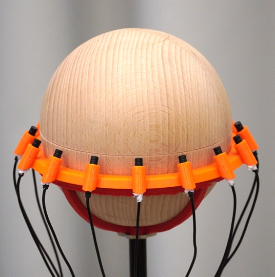
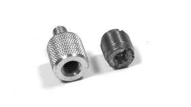

# Build-Your-Own Ambisonic Microphone Arrays

_(This repository is under construction.)_

## Summary

We provide a set of designs for ambisonic microphone arrays across a range of radii and orders. All designs will be equatorial microphone arrays (EMAs) for the foreseeable future.

Here is an example:

Demo videos of (other) EMAs can be found [here](https://youtu.be/OPWCXFbOFxU) and [here](https://youtu.be/5jAu47l2WaY).

The EMA concept was proposed in

    J. Ahrens, H. Helmholz, D. L. Alon, S. V. Amengual Garí, “Spherical 
    Harmonic Decomposition of a Sound Field Based on Observations Along 
    the Equator of a Rigid Spherical Scatterer” in J. Acoust. Soc. Am. 
    150(2), 2021.

Find the pdf [here](http://www.soundfieldsynthesis.org/wp-content/uploads/pubs/Ahrens_etal_JASA2021.pdf). Further details can be found in 

    J. Ahrens, “Ambisonic Encoding of Signals From Equatorial Microphone 
    Arrays,” Technical note v. 1, Chalmers University of Technology, 
    Aug. 2022.

Find the pdf [here](https://arxiv.org/pdf/2211.00584.pdf).

## Hardware

What we provide are 3D models of the microphone holders that you need to 3D print and combine with a spherical baffle. We use wooden spheres that we have from [here](https://www.holzlaedle.com/Heimwerken-und-Basteln/Kugel-und-Rundstab/Holzkugeln/). So far, we provide mic holders for spheres with 40 mm and with 60 mm radius. Each microphone holder is composed of two parts that are held together by screwing the baffle onto a microphone stand. We cut a suitable thread directly into the wood. If you do not have this possibility, you may want to consider gluing an adapter like these ones flush into the sphere:

The microphone holders assume that Røde Lavalier GO omnidirectional lapel microphones are used. We wrap a bit of thread seal tape around them so that they sit properly. Make sure that the tape respects the little edge on the microphone body. This makes sure that the diaphragm is positioned accurately. 

We use the microphones together with Røde VXLR+ adapters that allow for 48 V phantom power supply, which is provided by an Antelope MP32 microphone pre-amplifier. It has digitally programmable gains, which makes it easier to apply the same gain to all channels. See also the comments on calibration under ``Signal Processing`` below. A/D conversion is performed by an Antelope Orion 32 interface.

Note that you can find a similar 4th-order EMA for the Insta360 Pro camera [here](https://github.com/AppliedAcousticsChalmers/ambisonics-for-insta360-pro).

## Signal Processing

The signal processing for encoding the microphone signals into ambisonics and subsequent binaural rendering is currently only available in MATLAB here: https://github.com/AppliedAcousticsChalmers/ambisonic-encoding

It may be useful to calibrate the sensitivity of the microphones. We have observed differences of &plusmn;2 dB, which can make an audible difference. The simple solution is talking into the microphone array from above, recording all channels, and measuring the RMS of each channel.

## Acknowledgments

This work received funding under the Erasmus+ programme of the European Commission und grant 2022-1-PL01-KA220-VET-000085305.

## License
The content of this repository is licensed under the terms of the MIT license. Please consult the file [LICENSE](LICENSE) for more information about this license.
